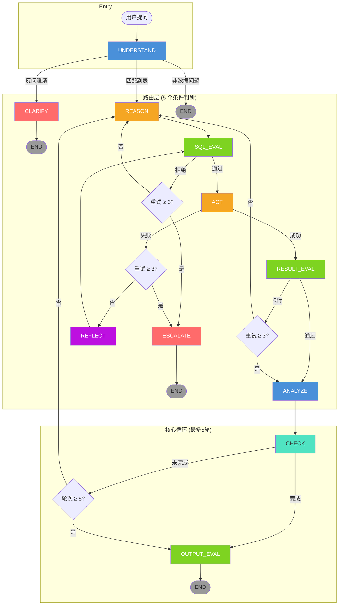

# ReAct Agent 状态机图

## 节点说明

| 节点 | 类型 | 职责 |
|------|------|------|
| UNDERSTAND | Agent | 意图解析 + 数据问题判断 + 相对时间反问 |
| REASON | Agent | 意图 → SQL |
| SQL_EVAL | Gate | SELECT/LIMIT/注入检测 |
| ACT | Exec | DuckDB 执行 SQL |
| REFLECT | Agent | 错误诊断 + 函数名直接替换 |
| RESULT_EVAL | Gate | 0 行检测 + 语义结果检查 |
| ANALYZE | Agent | 数据解读 + 图表生成 |
| CHECK | Agent | 问题回答完了吗？ |
| OUTPUT_EVAL | Gate | 幻觉检测（数值溯源） |
| CLARIFY | Agent | 反问澄清 |
| ESCALATE | Agent | 转人工 + 调整建议 |

## 三条自修正路径

| 错误类型 | 路由 | 上限 |
|---------|------|------|
| SQL 语法/安全检查不通过 | REASON 重写 | 3 次 → ESCALATE |
| SQL 执行失败（字段/函数不存在） | REFLECT 直接修复 | 3 次 → ESCALATE |
| 结果为空 | REASON 放宽条件 | 3 次 → ANALYZE |
| 分析不够深入 | CHECK → REASON 下钻 | 5 轮 → OUTPUT_EVAL |

## 条件路由分布

| 函数 | 从 | 到 | 条件 |
|------|----|----|------|
| `route_after_understand` | UNDERSTAND | CLARIFY / REASON / END | 有反问? / 非数据? |
| `route_after_sql_eval` | SQL_EVAL | ACT / REASON / ESCALATE | reject 且 <3 次? |
| `route_after_act` | ACT | RESULT_EVAL / REFLECT / ESCALATE | 有错误且 <3 次? |
| `route_after_result_eval` | RESULT_EVAL | ANALYZE / REASON | 0 行且 <3 次? |
| `route_after_check` | CHECK | OUTPUT_EVAL / REASON / ESCALATE | 完成? / 超 5 轮? |
